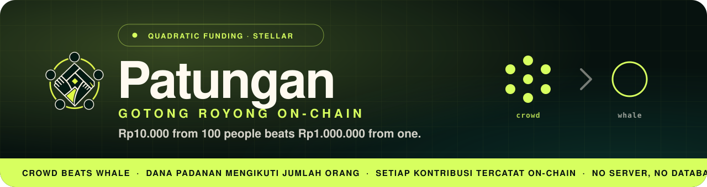

<p align="center">
    
</p>

<p align="center">
     <b>Rp10.000 from 100 people should beat Rp1.000.000 from one.</b>
     <br>
     <i>Patungan makes it so.</i>
</p>

A matching pool is split by <b>how many people</b> back a cause, not
<b>how much</b> any single wallet gives, so broad, grassroots support wins the biggest match.
It’s <i>gotong royong</i> (Indonesia’s tradition of communal mutual aid) the way it was always
meant to work: many small hands outweighing one deep pocket.

The mechanism is **Quadratic Funding**, running on the **Stellar** blockchain: every
contribution, match, and payout is transparent and verifiable on-chain, with **no server and no
database** in between.

<p align="center">
  
  
  
  
</p>

<p align="center">
  🏆 <b>APAC Stellar Hackathon</b> · Payment &amp; Consumer Applications · Stellar <b>Testnet</b>
</p>

<p align="center">
    <a href="https://patungan-stellar.vercel.app/">
        
    </a>
    &nbsp;
    <!-- TODO(demo): swap href="#demo" for the YouTube URL once the narrated walkthrough is uploaded. -->
    <a href="#demo">
        
    </a>
</p>

---

## Demo

> 🎬 **See it run.** Eight clips, one thread end-to-end: a crowd-backed school roof
> out-earning a whale-backed water well, live on Stellar testnet.

<table>
  <tr>
    <td width="50%" valign="top">
      
      <b>① Overview &amp; explore</b><br/>
      <sub>Land on Patungan and browse the open season — search, filter, and sort live campaigns.</sub>
    </td>
    <td width="50%" valign="top">
      
      <b>② Verify &amp; chip in</b><br/>
      <sub>Clear a SEP verification tier, then back a campaign in Freighter — the donor count ticks up live.</sub>
    </td>
  </tr>
  <tr>
    <td width="50%" valign="top">
      
      <b>③ Submit a campaign</b><br/>
      <sub>Anyone proposes a project: title, story, category, and the wallet that will receive funds.</sub>
    </td>
    <td width="50%" valign="top">
      
      <b>④ Curator approves</b><br/>
      <sub>A curator reviews the queue and admits the campaign into the open season.</sub>
    </td>
  </tr>
  <tr>
    <td width="50%" valign="top">
      
      <b>⑤ The reveal</b><br/>
      <sub>Results ranked by quadratic match: the crowd campaign beats the whale on fewer rupiah.</sub>
    </td>
    <td width="50%" valign="top">
      
      <b>⑥ Finalize the season</b><br/>
      <sub>The operator closes the round and the match pool locks to the on-chain results.</sub>
    </td>
  </tr>
  <tr>
    <td width="50%" valign="top">
      
      <b>⑦ Claim funds</b><br/>
      <sub>Recipients claim their direct raise plus quadratic match straight to their wallet.</sub>
    </td>
    <td width="50%" valign="top">
      
      <b>⑧ Open a season</b><br/>
      <sub>The operator opens a fresh season and picks which categories compete for the match pool.</sub>
    </td>
  </tr>
</table>

## How It Works

Four moves, all on-chain:

- 🤝 **Give.** Anyone can donate directly to a curated campaign, anytime: a straight
  contributor → campaign transfer (`contribute`).
- ⚖️ **Match.** Sponsors fund a matching **pool**. Each round, the pool is split by the
  quadratic formula, `match ∝ (Σ√contribution)²`, so a cause backed by *many* people earns a
  far bigger match than one backed by a single large donor. Only one round is open at a time,
  and finalizing freezes that round’s split.
- 🔐 **Verify.** Lightweight on-chain tiers gate who can act: `Basic` to give, `Institution`
  to sponsor a pool, via `set_verification`. KYC data never touches the chain; only the
  resulting tier does.
- 🧾 **Settle.** `finalize_round` computes and stores the split on-chain, and campaign owners
  `claim` their matched funds directly to their payout address.

Campaigns are grouped into **six curated categories**: Developing Regions, Disaster Relief,
Education, Health, Faith &amp; Community, and Environment &amp; Animals. Every submission is
reviewed by a **curator** before it becomes visible or matchable.

## Why It Matters

Indonesia is the **world’s most generous country, seven years running**, with **90% of people
donating** to charity ([CAF World Giving Index 2024][wgi]). Yet most of that giving, an
estimated **Rp600 trillion (~US$38 billion) a year** ([ANTARA][antara]), moves through
informal, opaque channels: *arisan*, mosque and church collections, disaster-relief drives,
village funds. There’s no transparency into where it lands, and no leverage that rewards broad
participation over a single large cheque.

Patungan brings that giving on-chain:

- **The wedge**: turn informal communal giving into a transparent, auditable public-goods
  platform, with a receipt for every rupiah in and out.
- **Why Stellar**: sub-cent fees and built-in fiat on/off-ramps make *micro*-contributions
  economically viable, in a way high-fee chains simply can’t.
- **The flywheel**: sponsor, CSR, and foundation capital gets *democratically allocated* by
  the crowd, so matching money follows genuine grassroots support instead of the loudest wallet.

[wgi]: https://www.prnewswire.com/news-releases/record-levels-of-global-generosity--indonesia-is-worlds-most-generous-country-with-kenya-second-and-singapore-rising-to-third-according-to-world-giving-index-2024-302226474.html
[antara]: https://en.antaranews.com/news/371009/indonesias-philanthropy-potential-capped-at-rp600-trillion-minister

## Architecture

Two modules, joined at deploy time:

<table>
  <tr>
    <th align="left">Module</th>
    <th align="left">Path</th>
    <th align="left">Stack</th>
    <th align="left">Role</th>
  </tr>
  <tr>
    <td><b>Contract</b></td>
    <td><code>contracts/patungan/</code></td>
    <td>Rust / Soroban</td>
    <td>Holds pools, records tagged contributions, runs the QF match per round, disburses</td>
  </tr>
  <tr>
    <td><b>Frontend</b></td>
    <td><code>frontend/</code></td>
    <td>Next.js 14 · React · TS</td>
    <td>Wallet connect, discovery, campaign self-serve, operator console, seasons, verification</td>
  </tr>
  <tr>
    <td><b>Scripts</b></td>
    <td><code>scripts/</code></td>
    <td>Bash + Node/TS</td>
    <td><code>deploy.sh</code> (deploy + write IDs), <code>seed.ts</code> (demo data), <code>e2e.ts</code> (smoke test)</td>
  </tr>
</table>

> **No server, no database.** The frontend reads chain state directly over Soroban RPC. The
> only coupling between the modules is the generated TypeScript bindings
> (`frontend/src/contract/`) plus the contract/token IDs written into `frontend/.env.local`.

**Deployed contract (Testnet):**

<p>
  <a href="https://lab.stellar.org/smart-contracts/contract-explorer?$=network$id=testnet&label=Testnet&horizonUrl=https:////horizon-testnet.stellar.org&rpcUrl=https:////soroban-testnet.stellar.org&passphrase=Test%20SDF%20Network%20/;%20September%202015;&smartContracts$explorer$contractId=CBEWV5XLRNWKB2CRBJYHCJ54FQJMUCU5S2CWL7S7RHCXBTWMZ2NWU4SO;;" target="_blank">
      
  </a>
</p>

```
CBEWV5XLRNWKB2CRBJYHCJ54FQJMUCU5S2CWL7S7RHCXBTWMZ2NWU4SO
```

## Who Does What

<table>
  <tr>
    <th align="left">Role</th>
    <th align="left">Needs</th>
    <th align="left">Can</th>
  </tr>
  <tr>
    <td><b>Guest</b></td>
    <td>–</td>
    <td>Browse campaigns and view QF results (read-only)</td>
  </tr>
  <tr>
    <td><b>Contributor</b></td>
    <td>Tier <code>Basic</code></td>
    <td>Contribute to approved campaigns</td>
  </tr>
  <tr>
    <td><b>Sponsor</b></td>
    <td>Tier <code>Institution</code></td>
    <td>Open a round, fund the matching pool, finalize a round</td>
  </tr>
  <tr>
    <td><b>Campaign Owner</b></td>
    <td>Tier <code>Basic</code></td>
    <td>Submit a campaign (self-serve), claim matched funds</td>
  </tr>
  <tr>
    <td><b>Curator / Attester</b></td>
    <td>Operator role</td>
    <td>Approve/reject campaigns · set verification tiers (Operator Console)</td>
  </tr>
</table>

## Roadmap

Today’s build is a complete, working product on Testnet. The scope lines below are deliberate,
each with a clear path forward:

- 🔐 **Real anchor KYC.** `/verify` runs the full SEP-10 → SEP-12 flow; with no reference anchor
  wired by default, it degrades to a clearly-labeled operator-attest path. *Next: wire a
  production anchor.*
- 🌐 **Server-side IPFS pin.** Campaign images pin from the browser via a scoped Pinata key.
  *Next: move pinning behind a signed endpoint.*
- 🔍 **Indexed discovery.** Search/discovery reads Soroban RPC directly (no index). Fine at
  this scale. *Next: a free read-index if it needs to scale.*
- 💸 **Mainnet.** Everything runs at **$0 on Testnet**; real money only enters on a mainnet
  launch, explicitly out of scope for this hackathon.

---

## Developer / Setup

<details>
<summary><b>Run it locally</b></summary>

<br/>

**Prerequisites**

<p>
  
  
  
</p>

```bash
# 1. Clone
git clone https://github.com/BudakGPT/patungan.git
cd patungan

# 2. Build & test the contract: 32 tests (multi-round QF, conservation, tier gates)
just contract-test

# 3. Deploy to Stellar Testnet (build wasm, deploy, init roles, write .env.local)
just deploy
just bindings              # regenerate frontend/src/contract/ from the deployed id

# 4. Seed a demo world (campaigns + a finalized season + an open round)
just seed

# 5. Run the frontend
cd frontend && npm install # bindings import TS source directly, no extra build
just dev                   # Next.js dev server

# 6. (optional) End-to-end smoke test: submit→approve→verify→contribute→finalize→claim
just e2e
```

> 💡 No [`just`](https://github.com/casey/just)? Open the `justfile` and run the underlying
> commands directly.

</details>

<details>
<summary><b>Environment variables</b></summary>

<br/>

`scripts/deploy.sh` writes `frontend/.env.local` for you (git-ignored). Two integrations are
opt-in:

```dotenv
# --- written by deploy.sh ---
NEXT_PUBLIC_NETWORK=TESTNET
NEXT_PUBLIC_SOROBAN_RPC_URL=https://soroban-testnet.stellar.org
NEXT_PUBLIC_NETWORK_PASSPHRASE=Test SDF Network ; September 2015
NEXT_PUBLIC_CONTRACT_ID=<fresh contract id>
NEXT_PUBLIC_TOKEN_ID=<the IDR-stand-in SAC address>
NEXT_PUBLIC_EXPLORER_BASE=https://stellar.expert/explorer/testnet
NEXT_PUBLIC_ADMIN_ADDRESS=<the operator public key>
NEXT_PUBLIC_ATTESTER_ADDRESS=<attester public key>
NEXT_PUBLIC_CURATOR_ADDRESS=<curator public key>

# --- IPFS image pinning: needed for real /campaign/new uploads ---
NEXT_PUBLIC_IPFS_GATEWAY=https://gateway.pinata.cloud/ipfs/
NEXT_PUBLIC_PINATA_JWT=<a scoped/short-lived Pinata upload JWT>

# --- testnet anchor: needed for real SEP-10/SEP-12 on /verify ---
NEXT_PUBLIC_ANCHOR_HOME_DOMAIN=<anchor's domain, for stellar.toml discovery>
NEXT_PUBLIC_ANCHOR_AUTH_ENDPOINT=<optional explicit SEP-10 WEB_AUTH_ENDPOINT override>
```

> Without the IPFS/anchor vars the app still builds and runs: `/campaign/new` surfaces a clear
> “not configured” error, and `/verify` falls back to the labeled **simulated attest**.

</details>

<details>
<summary><b>Routes</b></summary>

<br/>

| Route | Role | What it does |
|---|---|---|
| `/` | Anyone | Discovery: category filter, search, sort, the current round’s banner |
| `/campaign/[id]` | Anyone → Contributor | Campaign detail + inline contribute (gated: connect → Testnet → verified ≥ Basic) |
| `/campaign/new` | Campaign Owner | Self-serve submission (title/story/category/image → IPFS) |
| `/operator` | Sponsor / Curator / Attester | Open/fund/finalize a round, approve/reject campaigns, attest a tier |
| `/dashboard` | Campaign Owner | Owned campaigns, per-round match status, claim / claim-unmatched |
| `/seasons` | Anyone | Archive of past (finalized) rounds |
| `/results?round=` | Anyone | A single round’s QF reveal (direct vs. matched, ranked) |
| `/account` | Contributor | Own contribution history, reconstructed from on-chain contrib events |
| `/verify` | Anyone | SEP-10 anchor auth → SEP-12 KYC (or simulated-attest fallback) → TierBadge |

</details>

<details>
<summary><b>Project layout</b></summary>

<br/>

```
patungan/
├─ contracts/patungan/     # Soroban contract (Rust)
├─ frontend/               # Next.js 14 App Router app (React + TS)
├─ scripts/                # deploy.sh, seed.ts, e2e.ts
└─ justfile                # common tasks
```

</details>

**Tech stack**

<p>
  
  
  
  
  
  
  
</p>

---

## Contributors

<table>
    <tr>
        <td align="center">
            <a href="https://github.com/KareemMalik">
                
                <br /><sub><b>Malik Alifan Kareem</b></sub>
                <br /><sub>Project Manager</sub>
            </a>
        </td>
        <td align="center">
            <a href="https://github.com/helvenix">
                
                <br /><sub><b>Helven Marcia</b></sub>
                <br /><sub>Fullstack Developer</sub>
            </a>
        </td>
        <td align="center">
            <a href="https://github.com/haekalhdn">
                
                <br /><sub><b>Haekal Handrian</b></sub>
                <br /><sub>Fullstack Developer</sub>
            </a>
        </td>
        <td align="center">
            <a href="https://github.com/erikwilbert">
                
                <br /><sub><b>Erik Wilbert</b></sub>
                <br /><sub>Fullstack Developer</sub>
            </a>
        </td>
    </tr>
</table>

<p>
    <a href="https://github.com/BudakGPT/patungan">
        
    </a>
</p>

<sub>Built for the APAC Stellar Hackathon · Payment &amp; Consumer Applications · runs entirely on Stellar Testnet.</sub>
